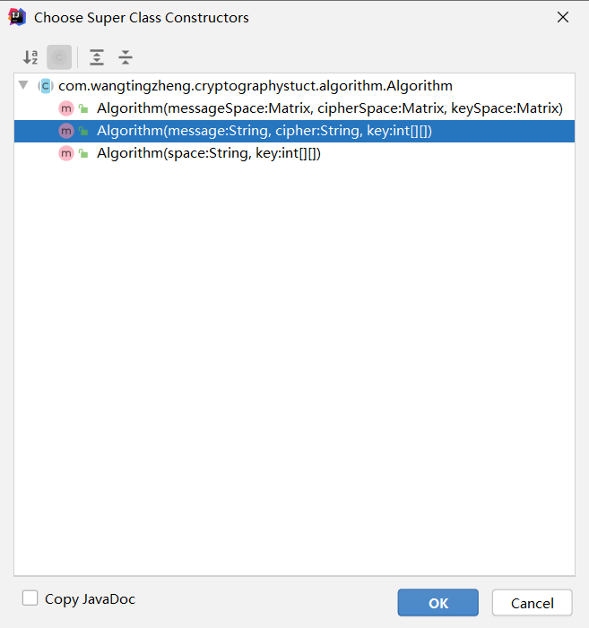

## 密码框架
### 使用
首先，你必须继承算法类`Algorithm`,并重写里面的各种方法，选择你愿意使用的构造方法:

```java
public class AlogrithmTest extends Algorithm
{
     public AlogrithmTest(Matrix messageSpace, Matrix cipherSpace, Matrix keySpace) {
            super(messageSpace, cipherSpace, keySpace);
        }
    
        public Test(String message, String cipher, int[][] key) {
            super(message, cipher, key);
        }
    
        public Test(String space, int[][] key) {
            super(space, key);
        }
    
        @Override
        public void decoding() {
    
        }
    
        @Override
        public void encoding() {
    
        }
    
        @Override
        public boolean checkMessageSpace() {
            return false;
        }
    
        @Override
        public boolean checkCipherSpace() {
            return false;
        }
    
        @Override
        public boolean checkKeySpace() {
            return false;
        }
}
```
#### 检查
对于`checkMessageSpace()`函数，它的任务是检查本类中的`messageSpace`，也就是明文空间是否符合加密算法的要求，你可以这样编写它:
```java
@Override
public boolean checkMessageSpace() {
    CharMatrix charMatrix = messageSpace.getMatrix();
    char[][] data = charMatrix.charData;
    if(....)
    {
        ....
        return true;
    }       
    return false;
}
```
当然你可以使用我给你写好的函数来协助你检查，比如说你可以直接调用一个函数来判断明文空间是否都是字母组成的字符串:
```java
    @Override
    public boolean checkMessageSpace() {
        CharMatrix charMatrix = messageSpace.getMatrix();
        return charMatrix.checkIsLetter();
    }
```
其它的检查函数同理。

#### 加解密
在`encoding()`函数中，你需要把本类中的`messageSpace`进行加密变换，再传入`cipherSpace`变量中，你可以通过本类中的三个Matrix变量空间来访问具体的明文空间、密文空间、密钥空间的值：
```java
char[][] message = messageSpace.getCharMatrix().charData;
char[][] cipher = cipherSpace.getCharMatrix().charData;
int[][] key = keySpace.getIntMatrix().intData;
```

